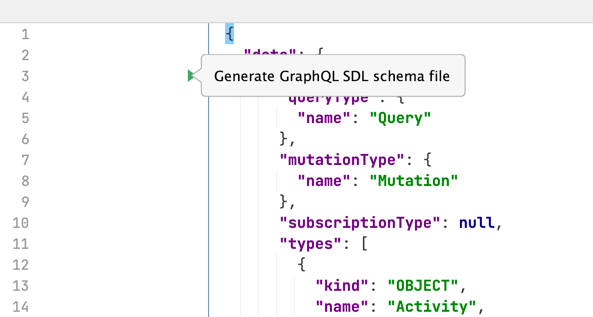

Android app skeleton
=======================================
[](https://circleci.com/gh/fs/android-base)
[](https://travis-ci.org/fs/android-base/pull_requests)
[](https://codecov.io/gh/fs/android-base)

This project will help you quickly start developing a new android app

## Table of Contents
1. [Setup. Install IDE, secret environment](#setup)
1. [Build. Create apk](#building)
1. [How to Deploy](#deploying-to-fabric)
1. [Run tests](#run-tests)
1. [ProGuard](#proguard)
1. [Credits](#credits)

## Setup
### Starting from base project
1. `git clone --depth 1 git://github.com/scalewill/android-base.git --origin android-base [NEW-PROJECT-NAME]`
1. `cd [NEW-PROJECT-NAME]`
1. `git remote add origin https://github.com/[NEW-PROJECT-GITHUB-ACCOUNT]/[NEW-PROJECT-NAME].git`
1. `git push -u origin master`
1. Update `APPLICATION_ID` in `app/build.gradle`.
1. Rename package under `app/src/main/java`.
1. Remove current and Credits sections from `README.MD`.

### IDE
1. Download latest Android Studio from https://developer.android.com/studio/index.html
1. Follow Android Studio installation instruction.
1. Download and install latest JDK8 http://www.oracle.com/technetwork/java/javase/downloads/jdk8-downloads-2133151.html.
1. Open Android Studio - Open Existing Android Project - find folder with project and click `OK`
1. Wait a while. Follow Android Studio instructions to install missing items.
1. Press `cmd + shift + a` and type `AVD Manager` and press Enter.
1. Press `Create Virtual Device...` button.
1. Select `Nexus 5X`
1. Select latest API level (in case if latest is not available then click `Download` and wait, it's going to take a while).
1. Click `Next`
1. Click `Finish`

### Updating secret keys
1. Run in the sh terminal ‘secrets/decrypt-keys.sh’ to decrypt google-services.json & keys.properties files
2. Add/remove keys inside `temp.properties`
3. Encrypt temp.properties back

```bash
openssl aes-256-cbc -e -md sha256 -nosalt -a -pass pass:{KEY} -in temp.properties -out ./secrets/keys.properties.crypted

```

4. Clean up: `rm temp.properties`.

### GraphQL requirement steps
1. Run in the sh terminal ‘secrets/download-graphql-schema.sh’ to download schema and generate Apollo classes by schema
2. Generate GraphQL SDL schema file to enable auto-completion for coding query file. [GraphQL IntelliJ Plugin](https://github.com/JetBrains/js-graphql-intellij-plugin) will help:



3. Make sure that app/main/graphql/com/flatstack/android/schema.json.graphql doesn't exist to run app

## Building
### Create APK
After you complete the `Gradle` project configuration, you can use `gradlew` executable to build the APK:
```bash
$ ./gradlew assembleDebug       // to build a debug APK
$ ./gradlew assembleRelease     // to build a release signed APK, can upload to Market
```
### Install
To install app on emulator or connected real device:
```bash
$ ./gradlew installDebug
```

### Deploying to Fabric
#### Deploy plugin configuring
Module build.gradle:
```groovy
defaultConfig {
    ...
    oneClickPublish {
        branchNames = ["master"]    // branch names from which you can deploy, master by default
        remoteRepoName = "origin"   // alias repository, origin by default
    }
    ...
}
```

#### Deploy steps:
1. To promote a new version run:
```bash
$ ./gradlew deployMajorVersion      //  increase major number
$ ./gradlew deployMinorVersion      //  increase minor number
$ ./gradlew deployPatchVersion      //  increase patch number
```
2. Wait until https://circleci.com finish build.
2. Open crashlytics application on Android device
2. Find Android Base app, click on it and click "Update".

<details>
<summary>TODO publishing and tester's inviting</summary>
 
### Publish to production
 
### Invitation for testers
</details>

### Run tests:
```bash
$ ./gradlew test
```

## ProGuard
Project already has proguard config for included libraries.
Maintain [proguard-rules.pro](https://github.com/scalewill/android-base/blob/master/app/proguard-rules.pro) updated when you add new libraries or play with reflection.
When you add new library or check out its Proguard section and add rules to `proguard-rules.pro`.
When you add code which uses reflection add rules to `proguard-rules.pro`.

## Credits
Android base app is maintained by [Scalewill](https://www.scalewill.com). [List of contributors](https://github.com/scalewill/android-base/contributors)

[](https://www.scalewill.com)
